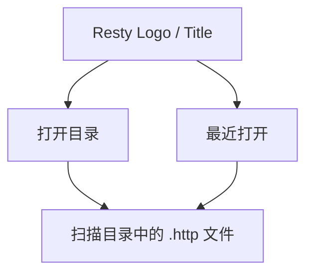
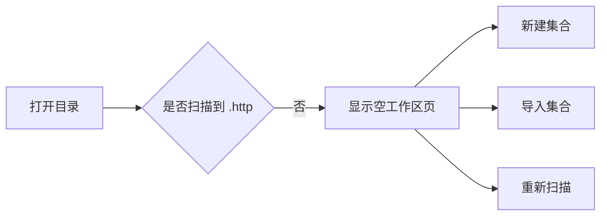
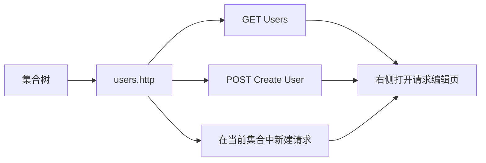
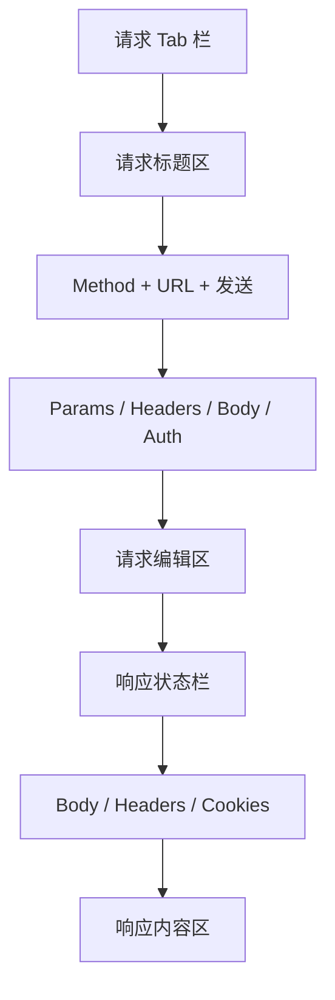
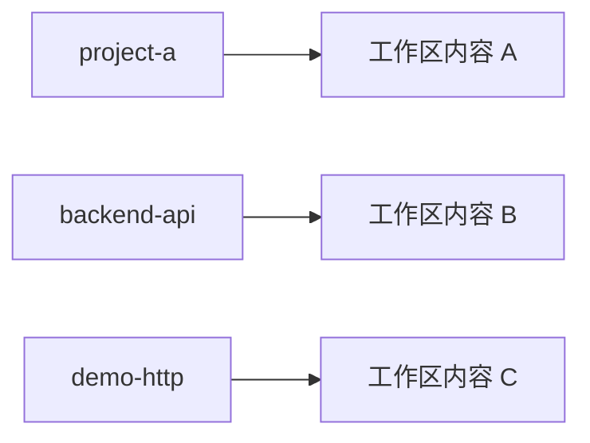
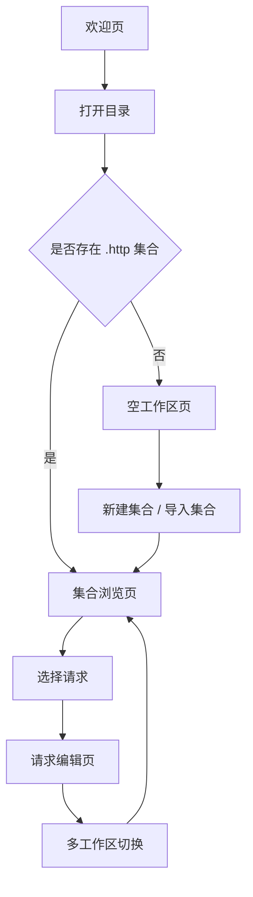
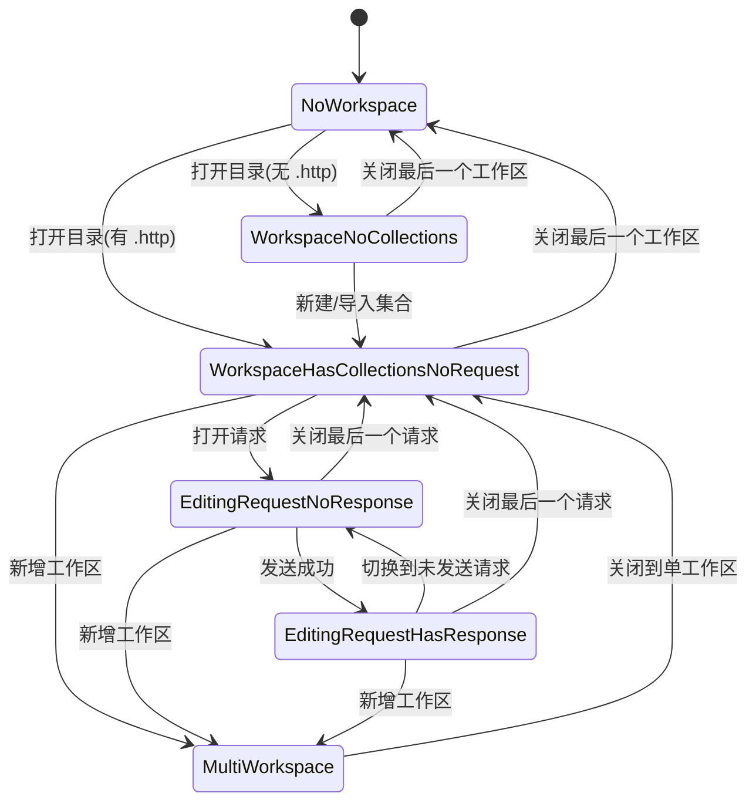
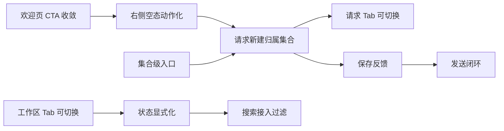

# Resty 主要操作页面与线框图

> 目标：把 Resty 当前与后续要稳定下来的几个主要操作页面梳理清楚，并给出一版可直接讨论的低保真线框。

---

## 设计前提

Resty 的信息架构建议固定为三层：

1. **工作区** = 一个目录
2. **集合** = 一个 `.http` 文件
3. **请求** = `.http` 文件中通过 `###` 拆分出的一个请求块

对应到界面：

1. **标题栏 Tab** 只负责切换工作区
2. **左侧面板** 只负责定位集合与请求
3. **右侧工作区** 只负责编辑请求与查看响应

---

## 主要操作页面

建议先稳定以下 5 个页面/状态：

1. 欢迎页：还没有打开任何工作区
2. 空工作区页：已经打开目录，但没有 `.http` 文件
3. 集合浏览页：已经打开目录，也扫描到了 `.http` 文件，但还没有打开请求
4. 请求编辑页：已经打开某个请求，正在编辑和发送
5. 多工作区切换页：已经打开多个目录，需要在工作区之间切换

---

## 页面 1：欢迎页

### 页面目标

让用户进入一个目录工作区，而不是直接创建悬空请求。

### 主动作

1. 打开目录
2. 从最近目录恢复

### 不建议放在这里的动作

1. 新建请求
2. 新建集合
3. 导入单个请求

### 线框图

```text
┌─────────────────────────────────────────────────────────────┐
│                                                             │
│                         Resty                               │
│                                                             │
│                面向目录的 .http 请求工作台                  │
│                                                             │
│                     [ 打开目录 ]                            │
│                                                             │
│  最近打开                                                    │
│  - project-a                                                 │
│  - backend-api                                               │
│  - demo-http                                                 │
│                                                             │
│  说明                                                        │
│  打开一个目录后，Resty 会自动扫描其中的 .http 文件。         │
│                                                             │
└─────────────────────────────────────────────────────────────┘
```

### Mermaid 图



---

## 页面 2：空工作区页

### 触发条件

已经打开目录，但当前目录下还没有扫描到 `.http` 文件。

### 页面目标

告诉用户现在缺的是“集合”，不是“请求”。

### 主动作

1. 新建集合
2. 导入集合
3. 重新扫描

### 线框图

```text
┌──────────────────── 工作区：project-a ─────────────────────┐
│ [project-a] [+ 打开目录]                          [设置]   │
├───────────────────────┬────────────────────────────────────┤
│ 搜索请求或集合         │                                    │
│ 当前工作区：project-a  │      当前目录中还没有 .http 集合   │
│ 当前环境：development  │                                    │
│                       │      [ 新建集合 ] [ 导入集合 ]      │
│ [新建集合] [导入集合]  │                                    │
│                       │      你也可以把现有 .http 文件放入   │
│ Collections           │      当前目录后重新扫描。            │
│   暂无集合             │                                    │
│                       │                                    │
│ Environments          │                                    │
│   development         │                                    │
└───────────────────────┴────────────────────────────────────┘
```

### Mermaid 图



---

## 页面 3：集合浏览页

### 触发条件

已经扫描到 `.http` 文件，但右侧还没有打开任何请求。

### 页面目标

让用户清楚看到：左侧是集合与请求导航，下一步是“选择请求”或者“在当前集合中新建请求”。

### 主动作

1. 搜索集合或请求
2. 展开某个 `.http` 集合
3. 选择其中一个请求
4. 在当前集合中新建请求

### 线框图

```text
┌──────────────────── 工作区：project-a ─────────────────────┐
│ [project-a] [backend-api] [+ 打开目录]            [设置]   │
├───────────────────────┬────────────────────────────────────┤
│ 搜索请求或集合         │                                    │
│                       │      从左侧选择一个请求开始编辑     │
│ 当前工作区：project-a  │                                    │
│ 当前环境：development  │      [ 在当前集合中新建请求 ]      │
│                       │                                    │
│ [新建集合] [导入集合]  │      当前集合：users.http          │
│                       │                                    │
│ Collections           │                                    │
│   users.http          │                                    │
│     GET Users         │                                    │
│     POST Create User  │                                    │
│   auth.http           │                                    │
│     POST Login        │                                    │
│                       │                                    │
│ Environments          │                                    │
│   development         │                                    │
│   production          │                                    │
└───────────────────────┴────────────────────────────────────┘
```

### Mermaid 图



---

## 页面 4：请求编辑页

### 触发条件

已经打开某个请求。

### 页面目标

让用户在不丢失上下文的前提下编辑请求、切换请求、发送请求并查看响应。

### 页面要点

1. 请求 Tab 只代表已打开的请求
2. URL 行附近要能看出请求属于哪个集合
3. 响应区要有明确的空状态与结果状态

### 线框图

```text
┌──────────────────── 工作区：project-a ─────────────────────┐
│ [project-a] [backend-api] [+ 打开目录]            [设置]   │
├───────────────────────┬────────────────────────────────────┤
│ 搜索请求或集合         │ [GET Users] [POST Login] [+]       │
│ 当前工作区：project-a  ├────────────────────────────────────┤
│ 当前环境：development  │ 集合：users.http                   │
│                       │                                    │
│ Collections           │ [GET ▾] [ https://api/...      ]   │
│   users.http          │ [发送]                              │
│     GET Users         ├────────────────────────────────────┤
│     POST Create User  │ Params | Headers | Body | Auth     │
│   auth.http           │ ---------------------------------- │
│     POST Login        │ 请求编辑区                          │
│                       │                                    │
│ Environments          ├────────────────────────────────────┤
│   development         │ 200 OK   120 ms   3.2 KB           │
│   production          │ Body | Headers | Cookies           │
│                       │ ---------------------------------- │
│                       │ 响应内容区                          │
└───────────────────────┴────────────────────────────────────┘
```

### Mermaid 图



### 请求编辑页空状态

如果请求还没发送，响应区建议显示：

```text
尚未发送请求

填写 URL 并点击“发送”后，在这里查看响应内容。
```

---

## 页面 5：多工作区切换页

### 触发条件

用户已经打开多个目录，例如一个后端项目目录、一个测试目录、一个演示目录。

### 页面目标

让用户清楚理解顶部 Tab 切换的是“目录工作区”，不是请求。

### 主动作

1. 切换工作区
2. 关闭工作区
3. 在不同工作区下保留各自的集合树与请求状态

### 线框图

```text
┌─────────────────────────────────────────────────────────────┐
│ [project-a] [backend-api] [demo-http] [+ 打开目录] [设置]  │
├───────────────────────┬────────────────────────────────────┤
│ 当前工作区：backend-api│ [POST Login] [GET Profile] [+]     │
│                       ├────────────────────────────────────┤
│ Collections           │ 集合：auth.http                    │
│   auth.http           │                                    │
│     POST Login        │ [POST ▾] [ https://api/...     ]   │
│     GET Profile       │ [发送]                              │
│   orders.http         │                                    │
│     GET Orders        │ ...                                │
└───────────────────────┴────────────────────────────────────┘
```

### Mermaid 图



---

## 页面关系总览



---

## 推荐的命名与按钮文案

### 顶层文案

1. 打开目录
2. 当前工作区
3. 当前环境
4. 新建集合
5. 导入集合
6. 在当前集合中新建请求
7. 发送

### 不建议使用的模糊文案

1. New Request（如果没有明确集合归属）
2. Open（如果对象不是目录）
3. Add（如果没有说明是加集合还是加请求）

---

## 实施优先级建议

如果要先做一版不大改架构的 UI 收敛，建议优先处理：

1. 欢迎页只保留“打开目录”作为主动作
2. 把“新建请求”收敛为“在当前集合中新建请求”
3. 右侧无请求时改成动作型空状态
4. 标题栏明确表达“工作区切换”
5. 左侧集合区补充“新建集合 / 导入集合”

这样先把目录、集合、请求三层职责稳定下来，再继续细化视觉和交互。

---

## 页面组件清单

以下清单用于把线框直接映射到控件与 ViewModel 字段，避免开发时遗漏。

### 页面 1：欢迎页组件

1. Logo 与标题区
2. 主按钮：打开目录
3. 最近目录列表
4. 说明文本区
5. 空列表占位（最近目录为空时）

建议的数据字段：

1. `RecentDirectories: IReadOnlyList<string>`
2. `HasRecentDirectories: bool`

建议的命令：

1. `OpenDirectoryCommand`
2. `OpenRecentDirectoryCommand`

### 页面 2：空工作区页组件

1. 顶部工作区 Tab 栏
2. 左侧搜索框
3. 左侧“新建集合 / 导入集合”按钮组
4. 左侧 Collections 区块（空态）
5. 右侧空态说明卡片
6. 右侧动作按钮：新建集合、导入集合、重新扫描

建议的数据字段：

1. `ActiveWorkspaceName: string`
2. `CollectionCount: int`
3. `HasCollections: bool`

建议的命令：

1. `CreateCollectionCommand`
2. `ImportCollectionCommand`
3. `RescanWorkspaceCommand`

### 页面 3：集合浏览页组件

1. 搜索框
2. 工作区信息条（当前工作区、当前环境）
3. Collections 树控件
4. 环境列表
5. 右侧“未打开请求”空态
6. 右侧动作按钮：在当前集合中新建请求

建议的数据字段：

1. `SearchText: string`
2. `RootNodes: ObservableCollection<CollectionTreeNode>`
3. `SelectedCollection: HttpCollection?`
4. `ActiveEnvironment: EnvironmentSet?`

建议的命令：

1. `OpenRequestCommand`
2. `CreateRequestInCollectionCommand`
3. `SelectEnvironmentCommand`

### 页面 4：请求编辑页组件

1. 请求 Tab 栏
2. 请求标题信息（所属集合）
3. Method 下拉
4. URL 输入框
5. 发送按钮
6. 请求编辑子 Tab（Params/Headers/Body/Auth）
7. 请求编辑内容区
8. 响应状态栏（状态码、耗时、大小）
9. 响应子 Tab（Body/Headers/Cookies）
10. 响应内容区

建议的数据字段：

1. `OpenRequests: ObservableCollection<RequestTabItem>`
2. `ActiveRequest: RequestTabItem?`
3. `SelectedMethod: HttpMethodOption`
4. `Url: string`
5. `RequestTabIndex: int`
6. `HasResponse: bool`
7. `ResponseStatus/ResponseTime/ResponseSize/ResponseBody`

建议的命令：

1. `SwitchRequestTabCommand`
2. `CloseRequestCommand`
3. `SendCommand`
4. `CreateRequestInCollectionCommand`

### 页面 5：多工作区切换页组件

1. 工作区 Tab 容器
2. 打开目录按钮
3. 工作区关闭按钮
4. 当前工作区内容容器（左侧树 + 右侧请求）

建议的数据字段：

1. `Workspaces: ObservableCollection<WorkspaceTab>`
2. `ActiveWorkspace: WorkspaceTab?`
3. `HasWorkspaces: bool`

建议的命令：

1. `SwitchWorkspaceCommand`
2. `CloseWorkspaceCommand`
3. `OpenDirectoryCommand`

---

## 状态清单

### 全局状态

1. `NoWorkspace`：无工作区
2. `WorkspaceNoCollections`：有工作区但无 `.http` 集合
3. `WorkspaceHasCollectionsNoRequest`：有集合但无打开请求
4. `EditingRequestNoResponse`：正在编辑请求但尚未发送
5. `EditingRequestHasResponse`：已发送并有响应
6. `MultiWorkspace`：打开了多个工作区

### 状态判定条件

1. `NoWorkspace`
    - `Workspaces.Count == 0`
2. `WorkspaceNoCollections`
    - `Workspaces.Count > 0`
    - `ActiveWorkspace.SidePanel.RootNodes.Count == 0`
3. `WorkspaceHasCollectionsNoRequest`
    - `RootNodes.Count > 0`
    - `ActiveWorkspace.ActiveRequest == null`
4. `EditingRequestNoResponse`
    - `ActiveWorkspace.ActiveRequest != null`
    - `HasResponse == false`
5. `EditingRequestHasResponse`
    - `ActiveWorkspace.ActiveRequest != null`
    - `HasResponse == true`
6. `MultiWorkspace`
    - `Workspaces.Count >= 2`

### 状态-页面映射

1. `NoWorkspace` -> 欢迎页
2. `WorkspaceNoCollections` -> 空工作区页
3. `WorkspaceHasCollectionsNoRequest` -> 集合浏览页
4. `EditingRequestNoResponse` -> 请求编辑页（响应空态）
5. `EditingRequestHasResponse` -> 请求编辑页（响应结果态）
6. `MultiWorkspace` -> 在顶部工作区栏增强展示

### 状态切换图



---

## 开发落地建议（按批次）

### 批次 A：可见性与命名

1. 收敛欢迎页主动作为“打开目录”
2. 统一“新建请求”为“在当前集合中新建请求”
3. 为右侧空态补动作按钮

### 批次 B：状态驱动显示

1. 把页面显示改为状态驱动
2. 让 `NoWorkspace / NoCollections / NoRequest` 三类空态互斥
3. 响应区区分“未发送”和“已有响应”

### 批次 C：导航一致性

1. 工作区 Tab 补切换命令
2. 请求 Tab 补切换命令
3. 搜索框接入集合/请求过滤

---

## 开发任务清单（按 View / ViewModel / Command 文件拆分）

> 用法建议：每一项都可以直接转为一个 issue。优先顺序按 P0 / P1 / P2 标注。

### P0：先修正语义与主流程（已完成）

#### 任务 A1：欢迎页 CTA 语义收敛（已完成）

- 状态：✅ 已完成（commit `651af98`）

- 文件：`src/Views/Welcome.axaml`
- 目标：欢迎页主动作只保留“打开目录”，移除误导性的“新建请求”主入口。
- 改动点：
1. 第二个按钮不再绑定 `OpenDirectoryCommand` 伪装成“新建请求”。
2. 如果保留第二入口，改成“最近目录”或“查看示例目录”。
- 验收标准：
1. 首屏只有一个主 CTA（打开目录）。
2. 不会出现“新建请求=打开目录”的语义冲突。

#### 任务 A2：右侧空态改为动作型空态（已完成）

- 状态：✅ 已完成（commit `651af98`）

- 文件：`src/Views/MainWindow.axaml`
- 目标：有工作区但无活动请求时，给出明确下一步。
- 改动点：
1. 将当前纯文案 `Select a request or create a new one` 改为包含按钮的空态块。
2. 增加“从左侧选择请求”和“在当前集合中新建请求”引导。
- 验收标准：
1. 用户在无请求状态下不需要猜下一步。
2. 空态文案明确“请求属于集合”。

#### 任务 A3：请求新建入口归属到集合（已完成）

- 状态：✅ 已完成（commit `651af98`）

- 文件：`src/ViewModels/WorkspaceTab.cs`
- 目标：避免创建无集合归属的悬空请求。
- 改动点：
1. `NewRequest()` 改为“在选中集合中创建请求”。
2. 当未选中集合时返回提示或禁用入口。
- 验收标准：
1. 新建请求后可定位其所属 `.http` 集合。
2. 不再出现 `_collection is null` 导致不可写回的默认路径。

### P1：补齐导航一致性

#### 任务 B1：工作区 Tab 可切换（已完成）

- 状态：✅ 已完成（commit `651af98`）

- 文件：`src/ViewModels/MainWindow.cs`
- 文件：`src/Views/MainWindow.axaml`
- 目标：顶部工作区 Tab 可点击切换，不再只有关闭按钮。
- 改动点：
1. 在 `MainWindow` 暴露 `SwitchWorkspaceCommand`。
2. 在工作区 Tab 容器绑定点击事件/命令到该命令。
- 验收标准：
1. 打开 2 个以上工作区时，点击 Tab 会切换 `ActiveWorkspace`。
2. 视觉状态与实际激活状态一致。

#### 任务 B2：请求 Tab 可切换（已完成）

- 状态：✅ 已完成（commit `651af98`）

- 文件：`src/ViewModels/WorkspaceTab.cs`
- 文件：`src/Views/MainWindow.axaml`
- 目标：请求 Tab 可点击切换，不再只有关闭按钮。
- 改动点：
1. 在 `WorkspaceTab` 暴露 `SwitchRequestCommand`。
2. 请求 Tab Border 或主区域绑定切换命令。
- 验收标准：
1. 打开多个请求时可来回切换。
2. `IsActive` 与编辑区内容同步。

#### 任务 B3：工作区状态显式化

- 文件：`src/ViewModels/MainWindow.cs`
- 文件：`src/Views/MainWindow.axaml`
- 目标：把 `NoWorkspace / NoCollections / NoRequest / ActiveRequest` 变成可驱动 UI 的状态。
- 改动点：
1. 新增可绑定状态字段或状态枚举。
2. 用状态驱动欢迎页、空工作区页、空请求页显示。
- 验收标准：
1. 三类空态互斥，不重叠。
2. 状态切换无闪烁、无错误文案。

### P1：补齐集合导航可用性

#### 任务 C1：搜索框接入过滤逻辑

- 文件：`src/ViewModels/CollectionPanel.cs`
- 文件：`src/Views/CollectionPanel.axaml`
- 目标：`SearchText` 真正影响集合树展示。
- 改动点：
1. 增加过滤后的节点集合（例如 `FilteredRootNodes`）。
2. `SearchText` 变更后进行请求名/方法/URL 匹配。
3. 命中请求时自动展开父集合。
- 验收标准：
1. 输入关键字后左侧树实时过滤。
2. 无匹配时显示“未找到匹配项”。

#### 任务 C2：新增集合级动作入口

- 文件：`src/Views/CollectionPanel.axaml`
- 文件：`src/ViewModels/CollectionPanel.cs`
- 目标：明确“集合层”动作，减少全局入口越权。
- 改动点：
1. 增加“新建集合 / 导入集合”按钮。
2. 提供对应命令骨架（可先 stub）。
- 验收标准：
1. 用户可以在左侧完成集合创建入口。
2. 不必依赖右侧或欢迎页做集合层动作。

### P2：请求读写与反馈完善

#### 任务 D1：请求保存反馈与归属提示

- 文件：`src/ViewModels/RequestTab.cs`
- 文件：`src/Views/RequestTab.axaml`
- 文件：`src/Commands/HttpFileWriter.cs`
- 目标：用户明确知道“当前请求归属哪个集合、是否已保存”。
- 改动点：
1. 在请求页显示所属集合名。
2. 暴露保存状态（已保存/未保存）。
3. 写回后更新状态显示。
- 验收标准：
1. 编辑后有保存状态反馈。
2. 不再出现“改了但不知道写到哪里”的体验。

#### 任务 D2：发送动作结果闭环

- 文件：`src/ViewModels/RequestTab.cs`
- 文件：`src/Views/RequestTab.axaml`
- 目标：发送后必有可见状态变化，即使暂时是 mock。
- 改动点：
1. `Send()` 至少设置 `IsSending`、失败/成功结果、响应空态切换。
2. 未实现网络前可给出“暂未接入发送引擎”的明确提示。
- 验收标准：
1. 点击发送后 UI 有反馈。
2. 用户不会误以为按钮无效。

---

## 任务依赖关系



---

## 一周落地节奏建议

1. Day 1-2：A1 + A2 + A3
2. Day 3：B1 + B2
3. Day 4：B3 + C2
4. Day 5：C1
5. Day 6-7：D1 + D2

按照这个顺序推进，可以先把“看起来乱”的核心问题压下去，再补功能闭环。